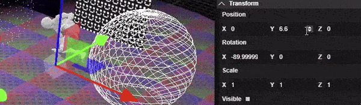

# Hermes

An extendable set of Web Tools controlled over a separate window for non-intereference with content (like a remote controller!)

Open the [Application](https://hermes-lovat.vercel.app/) and [editor](https://hermes-lovat.vercel.app/#editor) side-by-side.

## Setup

This example uses [React](https://react.dev/), [ThreeJS](https://threejs.org/), and [TheatreJS](https://theatrejs.com/).

### Create an `Application`

An application isn't required, however it's nice to maintain multiple remotes. Alternatively, Remotes can be created independently.

The `ThreeEditor` is used as a multi-view editor for [ThreeJS](https://threejs.org/), and should be limited to only the Editor app.

```
const IS_DEV = true;
const IS_EDITOR = IS_DEV && document.location.hash.search('editor') > -1;

const theatre = new RemoteTheatre(IS_DEV, IS_EDITOR);
const three = new RemoteThree('Hermes Example', IS_DEV, IS_EDITOR);

export default function AppWrapper() {
  const [app, setApp] = useState<Application | null>(null);

  useEffect(() => {
    const instance = new Application();
    instance.detectSettings(IS_DEV, IS_EDITOR).then(() => {
      // TheatreJS
      instance.addComponent('theatre', theatre);

      // ThreeJS
      instance.addComponent('three', three);

      // Ready
      setApp(instance);
    });
  }, []);

  // MultiView requires you identify each scene so they can be instantiated by the editor
  const scenes: Map<string, any> = new Map();
  scenes.set('Scene1', Scene1);
  scenes.set('Scene2', Scene2);
  scenes.set('RTTScene', RTTScene);

  return (
    <>
      {app !== null && (
        <>
          {IS_DEV && (
            <>
              <SceneInspector three={three} />

              {IS_EDITOR && (
                <ThreeEditor
                  three={three}
                  scenes={scenes}
                  onSceneUpdate={(scene: any) => {
                    scene.update();
                  }}
                />
              )}
            </>
          )}
        </>
      )}
    </>
  );
}
```

### Scene setup

After all object's have been added to your scene, run `hierarchyUUID(yourScene)` to update the UUIDs of every object. This helps communicate back and forth between the app and your editor.

### Custom remote commands

This component is added only in debug-mode to add extra support for remote-components.

In this example it's added to add custom Remote Component support for:

- [ThreeJS](https://threejs.org/) - `SceneInspector` communicates with the Multi-view editor
- [TheatreJS](https://theatrejs.com/) - Communicates with the `studio` instance

```
type RemoteProps = {
  three: RemoteThree
  theatre: RemoteTheatre
}

export default function RemoteSetup(props: RemoteProps) {
  // Remote Theatre setup
  props.theatre.studio = studio;
  props.theatre.handleEditorApp();

  return <SceneInspector three={props.three} />;
}
```

## Editor

### Tools for:

- Customizable Navigation Dropdowns + Draggable components for Triggers/Event Dispatching
- [TheatreJS](https://www.theatrejs.com/)
- [ThreeJS](https://threejs.org/)
- Custom ThreeJS Scene + Object Inspector

### ThreeJS Editor

| Action | Keys |
| ------ | ------ |
| Zoom to Selected Item | CTRL + 0 |
| Rotate to Front of Selected Item | CTRL + 1 |
| Rotate to Top of Selected Item | CTRL + 2 |
| Rotate to Right of Selected Item | CTRL + 3 |
| Rotate to Back of Selected Item | CTRL + 4 |
| Set Transform Controls to Rotate | r |
| Set Transform Controls to Scale | s |
| Set Transform Controls to Translate | t |
| Toggles Transform Controls between **world** and **local** | q |

### Side Panel

Holding down the **CTRL** key while dragging a number's label will multiply the delta by 10



### Assets

Animation / Models found at [Mixamo](https://www.mixamo.com/)
