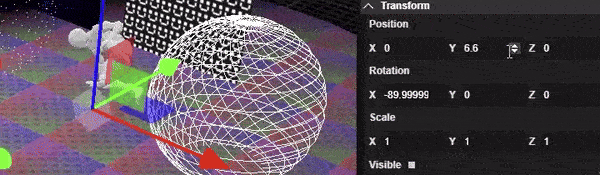

# Hermes

An extendable set of Web Tools controlled over a separate window for non-intereference with content (like a remote controller!)

Open the [Application](https://hermes-lovat.vercel.app/) and [editor](https://hermes-lovat.vercel.app/#editor) side-by-side.

## Setup

This example uses [React](https://react.dev/), [ThreeJS](https://threejs.org/), and [TheatreJS](https://theatrejs.com/).

### Create an `Application`

Instantiate your `Application` (or a custom subclass) outside the component tree, then wrap your app with `HermesApp`. It handles `detectSettings`, the loading gate, Theatre Studio initialisation, and automatically switches between editor and app rendering based on `IS_EDITOR`.

```tsx
import studio from '@tomorrowevening/theatre-studio';
import HermesApp from '@tomorrowevening/hermes/editor/HermesApp';
import ExampleApplication from './three/ExampleApplication';
import { loadAssets } from './three/loader';
import Scene1 from './three/scenes/Scene1';
import Scene2 from './three/scenes/Scene2';
import MyCanvas from './components/MyCanvas';
import { IS_DEV, IS_EDITOR } from './constants';

// Register scene classes so MultiView can instantiate them in the editor
const scenes = new Map<string, any>([
  ['Scene1', Scene1],
  ['Scene2', Scene2],
  ['RTTScene', RTTScene],
]);

// Create once outside the component — avoids re-instantiation on re-render
const app = new ExampleApplication('My Project', IS_DEV, IS_EDITOR);
if (IS_DEV && IS_EDITOR && studio) {
  studio.initialize();
  app.theatre.studio = studio;
  app.theatre.handleEditorApp();
}

export default function AppWrapper() {
  return (
    <HermesApp
      app={app}
      scenes={scenes}
      onSceneAdd={(scene) => {
        scene.setup(app);
        scene.init();
      }}
      onSceneUpdate={(scene) => scene.update()}
      onLoad={loadAssets}
    >
      {(app) => <MyCanvas app={app} />}
    </HermesApp>
  );
}
```

#### `HermesApp` props

| Prop | Type | Description |
| --- | --- | --- |
| `app` | `Application` | Application instance with RemoteTheatre + RemoteThree added as components |
| `scenes` | `Map<string, any>` | Scene name → scene class map, used by the editor's MultiView |
| `onSceneAdd` | `(scene) => void` | Called when MultiView instantiates a scene (setup + init) |
| `onSceneUpdate` | `(scene) => void` | Called every frame for the active scene in the editor |
| `onSceneResize` | `(scene, w, h) => void` | Called when MultiView resizes a scene |
| `onLoad` | `(app) => Promise<void>` | Asset loading function — `HermesApp` waits for this before rendering children |
| `renderLoading` | `ReactNode` | Shown while `detectSettings` or `onLoad` is pending |
| `children` | `(app) => ReactNode` | App content rendered after loading completes (not shown in editor mode) |

### Scene setup

After all object's have been added to your scene, run `hierarchyUUID(yourScene)` to update the UUIDs of every object. This helps communicate back and forth between the app and your editor.

### Theatre Studio integration

Theatre Studio is initialised before `HermesApp` is mounted. Wire it up on the `app` instance so `HermesApp` can hand it off to the editor automatically:

```tsx
import studio from '@tomorrowevening/theatre-studio';

const app = new ExampleApplication('My Project', IS_DEV, IS_EDITOR);
if (IS_DEV && IS_EDITOR && studio) {
  studio.initialize();
  app.theatre.studio = studio;
  app.theatre.handleEditorApp();
}
```

## Editor

### Tools for:

- Customizable Navigation Dropdowns + Draggable components for Triggers/Event Dispatching
- [TheatreJS](https://www.theatrejs.com/)
- [ThreeJS](https://threejs.org/)
- Custom ThreeJS Scene + Object Inspector

### ThreeJS Editor

| Action | Keys |
| ------ | ------ |
| Zoom to Selected Item | CTRL + 0 |
| Rotate to Front of Selected Item | CTRL + 1 |
| Rotate to Top of Selected Item | CTRL + 2 |
| Rotate to Right of Selected Item | CTRL + 3 |
| Rotate to Back of Selected Item | CTRL + 4 |
| Set Transform Controls to Rotate | r |
| Set Transform Controls to Scale | s |
| Set Transform Controls to Translate | t |
| Toggles Transform Controls between **world** and **local** | q |

### Side Panel

Holding down the **CTRL** key while dragging a number's label will multiply the delta by 10



### Assets

Animation / Models found at [Mixamo](https://www.mixamo.com/)
